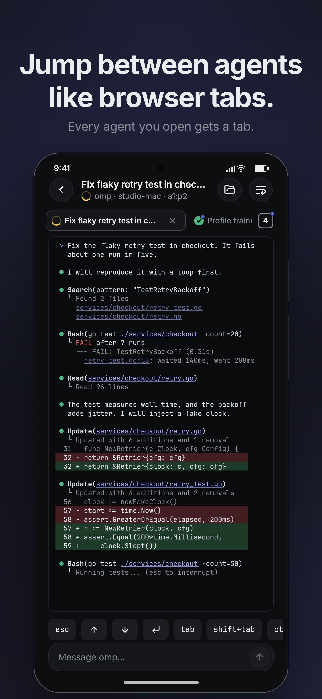
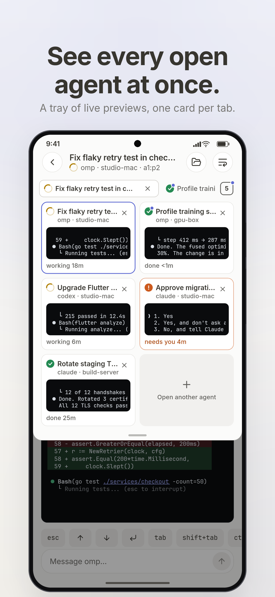

# herdr mobile

A Flutter client for [herdr](https://herdr.dev) — see every coding agent across
all your machines, know the moment one needs you, and reply from your phone.

```
phone ──SSH──▶ machine A ── one multiplexed channel ──▶ herdr socket
      ──SSH──▶ machine B ── …
```

No relay, no public ports, no account. The app authenticates over SSH (key,
password, or Tailscale SSH) and keeps **one persistent channel per machine** that carries every
request (a tiny relay script on the host; needs `python3`). Hosts without it
fall back to `herdr remote-api-bridge` (herdr ≥ 0.9), then `socat`/`python3`,
one channel per request: slower, same behaviour. Each machine has its own
connection, backoff and reconnect; one machine failing never affects another.


<p>
  
  
  
</p>
<p>
  
  
  
</p>
<p>
  
  
  
</p>

Regenerate with `tool/screenshots/run.sh` (renders a demo fleet through the real
widgets, then frames it; needs Pillow).

## Features

- Multiple machines; add / edit / disable / remove, with **Test connection**
  (shows herdr version, workspace count and the host key before you trust it).
- Agents board across all machines, grouped by urgency
  (blocked → working → done → idle) with a badge for what needs you.
- Machine browser: workspaces → tabs → panes.
- **Live board**: every agent is a card with a preview of its terminal's last
  rows, the time it has been in its state, and, when it is blocked on a prompt,
  one-tap answers taken from the prompt itself (`1. Yes`, `2. No`...). A
  "N need you" pill steps through the blocked agents; answer from a sheet
  without leaving the board. Previews end with what the agent said, not with
  its input box and status bar. Nothing on the board animates.
- **Browser-style tabs** in the pane screen: a strip of open agents, a dot on a
  background tab that needs you, and a tray with a preview card per tab. Each
  tab keeps its scroll and history; only the visible one reads.
- Live pane view in colour (truecolor/256/16, bold/dim/italic/underline),
  virtualized so a long scrollback stays at full frame rate. Type a line or
  send keys (esc, tab, ctrl+c, arrows, enter). Updates arrive on activity,
  not by polling, and stop while the app is in the background.
- Built for phone networks: switching Wi-Fi/cellular or losing signal is
  detected (machines show "No network" and reconnect within a second of
  returning), a half-dead connection is noticed in under ~15 s, and the last
  state paints instantly on launch, dimmed until it is fresh.
- Scrollback: tails 300 rows, loads herdr's maximum of 1000 when you scroll up,
  and keeps what scrolls past while the pane is open (herdr itself serves at
  most the last 1000 rows of a pane).
- Links and files in terminal output are underlined and tappable: URLs open in
  the browser (or copy), file paths open a remote viewer.
- Remote file browser and viewer over SFTP: source files with line numbers and a
  highlighted line, Markdown, JSON, zoomable images, hex preview for binaries.
- New agent session: pick a machine and folder, choose a shell or an agent,
  optionally send a first message. Rename and close workspaces and panes.
- Event-driven updates (`events.subscribe`) with a slow poll as a backstop.
- Host keys pinned on first use; a changed key is a hard stop.
- Secrets live in the platform keychain, never in preferences.
- **Tailscale SSH** (`Tailscale` auth option): nothing to paste, no key stored.
  Needs the Tailscale app signed in on the phone. If your tailnet policy uses
  check mode, the machine shows "Waiting for approval" with an **Open sign-in
  page** button; approve in the browser and the connection continues by itself.
  Only `https` links from the login banner are ever opened.
- Terminal drawn cell by cell: seamless coloured blocks and pixel-exact box
  drawing (`┌─┐│└┘`, blocks, shades) instead of font glyphs, pinch to zoom the
  font, and a **wrap** toggle that re-flows wide desktop panes to the phone's
  width (herdr cannot resize a pane over its socket API).

## Install (Android)

Download `herdr-mobile-<version>.apk` from the repo's *Releases* page, allow
installs from unknown sources, and open it. One file covers every Android 7.0+
phone (32-bit and 64-bit ARM). Verify the download against `SHA256SUMS`.

## Performance

Measured against a live herdr over SSH to localhost (so network latency is
zero and everything shown is overhead the app controls):

| | before | after |
| --- | --- | --- |
| `ping` round-trip, p50 | 49 ms | 0.9 ms |
| `pane.read` (300 lines), p50 | 65 ms | 16 ms |
| `session.snapshot`, p50 | 83 ms | 39 ms |
| session refetches in 15 s, busy agents | 33 | 1 |
| UI notifications in 15 s, busy agents | 35 | 2 |

Two things did most of the work: one multiplexed channel instead of a shell
plus two process spawns per request, and recognising that a `pane_updated`
event carries the whole pane, so spinner churn needs no refetch at all.

### Smooth scrolling on a phone

Request latency is not what makes a terminal feel bad on a phone; **frozen
frames** are. Profiled on a mid-range phone (Galaxy A51, profile build) against
a pane streaming ~140 KB per refresh, with real touch swipes:

| | before | after |
| --- | --- | --- |
| Main-thread freezes per swipe | 2–3, up to 687 ms | 0 |
| Frames over 40 ms per swipe | 5–18 | 0–2 |
| Freezes while typing into a streaming pane | yes | 0 |

What caused it, in order of impact:

1. **The SSH cipher.** dartssh2 encrypts in pure Dart and its default order
   picks AES-GCM, which runs at ~1 MB/s through the library (ChaCha20-Poly1305
   and AES-CTR: 30–40 MB/s). A pane refresh therefore blocked the UI for ~600 ms.
   The app prefers ChaCha20-Poly1305, then AES-CTR.
2. **Work on the UI thread.** All network, decryption and JSON decoding now
   runs in a background isolate per machine (`IsolateTransport`).
3. **Renderer.** On this phone Impeller runs its OpenGL ES backend (a forced
   Vulkan request still lands on OpenGL ES), and in the same four swipes it
   produced 51 frames over 40 ms against Skia's 5, so Android builds opt out of
   Impeller. See the note in `AndroidManifest.xml`; re-measure after Flutter
   upgrades and on other phones.
4. **Redundant work per update:** responses were decoded twice, all 300 lines
   re-parsed, and every visible line re-laid-out when one line was appended.
   Parsing is now incremental and lines keep a stable identity.
5. **A looping animation** (the working-agent pulse) kept the GPU busy
   continuously, so it was removed.

## Design

Not Material. Notion-style paper in light, Linear-style ink in dark: flat rows
instead of cards, large bold titles that collapse into a compact bar, status as
a shape (`StatusGlyph`) as well as a colour, one accent, hairlines instead of
elevation, a floating tab bar, Inter + JetBrains Mono, Lucide icons. The system
lives in `app/lib/ui/core/` and is written up in [`docs/DESIGN.md`](docs/DESIGN.md).

## Layout

```
app/lib/
  data/
    models/         herdr_models.dart, machine_profile.dart
    services/       herdr_transport.dart (interface), ssh_transport.dart,
                    mux_client.dart (persistent request channel),
                    bridge_command.dart, herdr_api.dart,
                    network_monitor.dart, snapshot_cache.dart
    repositories/   machine_repository.dart   saved machines + secrets
                    machine_connection.dart   one machine: snapshot + reconnect
                    fleet_repository.dart     all machines, merged agent list
                    terminal_settings.dart    pane font size + wrap mode, saved
                    app_settings.dart         theme choice (light by default), saved
  ui/
    core/           theme, motion tokens, shared widgets, ansi parser,
                    terminal view: a cell grid (backgrounds and box drawing
                    painted per row, snapped to device pixels; see
                    terminal_cells.dart, box_drawing.dart), line wrapping
                    to the phone's width (line_wrap.dart), pinch to zoom
    features/       agents/, machines/, pane/, settings/   (views + view models)
    shell/          bottom navigation (Agents, Machines, Settings)
docs/herdr-api.schema.json   protocol schema, from `herdr api schema` (0.8.2)
third_party/                 reference clones (not part of the build)
.agents/skills/              Flutter + Dart skills (flutter/agent-plugins) and
                             design/motion skills (emilkowalski/skills)
```

Architecture follows the `flutter-apply-architecture-best-practices` skill:
views → `ChangeNotifier` view models → repositories → services.

## Develop

Requires Flutter ≥ 3.47 (Dart ≥ 3.13).

```bash
cd app
flutter pub get
flutter analyze
flutter test                 # unit tests
flutter run                  # device / emulator
flutter run -d linux         # desktop, handy for iterating
```

### Reference clones

`third_party/` is git-ignored. To recreate it (read-only references used while
building the app; not build inputs):

```bash
cd third_party
git clone https://github.com/herdrdev/herdr
git clone https://github.com/dcolinmorgan/herdr-remote
git clone https://github.com/jerryfane/herdrup
git clone https://github.com/flutter/agent-plugins
git clone https://github.com/emilkowalski/skills
```

### Android release build

```bash
export ANDROID_HOME=/path/to/android-sdk   # platforms;android-36, build-tools;36.0.0
cd app
flutter build apk --release --target-platform android-arm,android-arm64
```

Release signing reads `app/android/key.properties` (git-ignored):

```properties
storeFile=/abs/path/release.jks
storePassword=…
keyAlias=herdr-mobile
keyPassword=…
```

Without it the build falls back to the debug key, which is fine for
`flutter run --release` but must not be published. Keep the keystore backed up:
an update only installs over an earlier release if it is signed with the same key.

### Requirements on each remote machine

- sshd reachable from the phone (LAN, VPN or tailnet recommended).
- herdr running. herdr ≥ 0.9 is best; older builds need `socat` or `python3`
  and use the default session unless you set the socket path in *Advanced*.

### Known limits

- Windows herdr hosts are not supported (the bridge is a POSIX shell script).
- Pane output is read-only text: no cursor or mouse, and one screenful of
  scrollback (the last 300 lines).
- Private keys are pasted in; there is no file picker yet.
- Push notifications need a relay and are out of scope; the app updates live
  while open and on resume.
