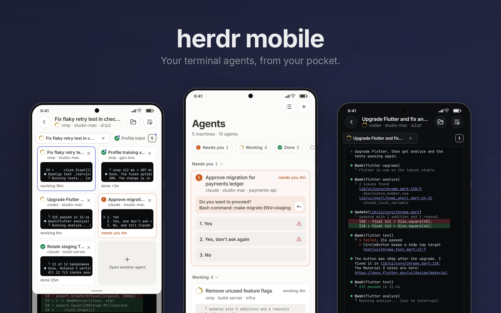
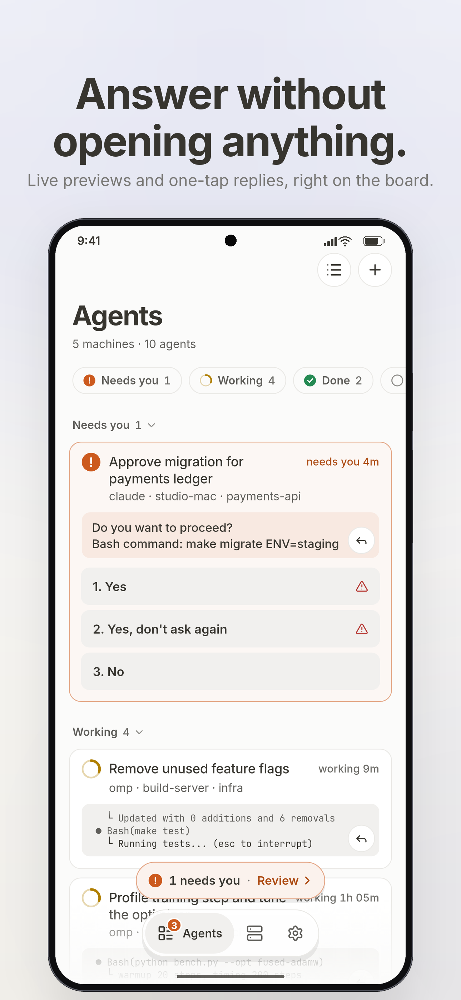
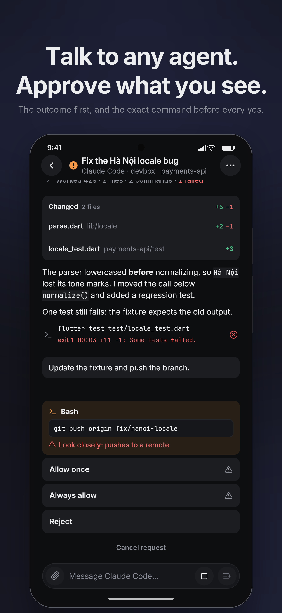
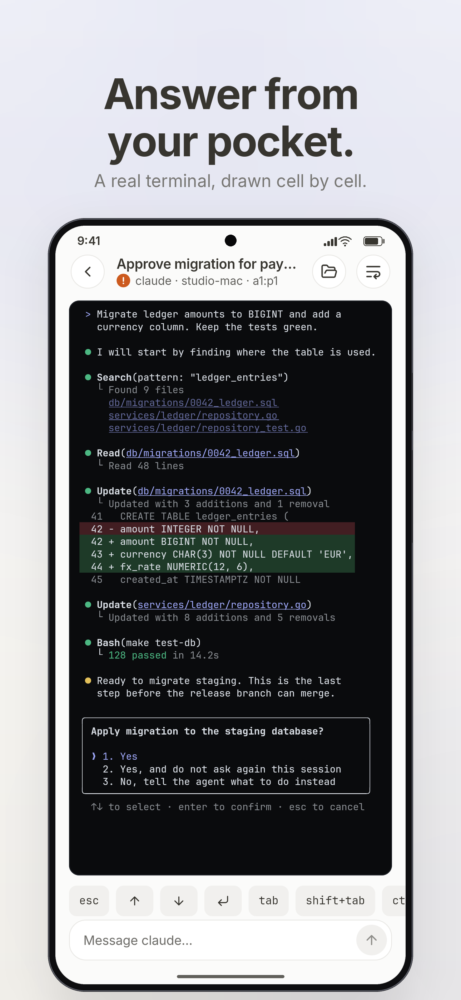

# herdr mobile

Your coding agents, in your pocket. herdr mobile shows every agent on every
machine you run [herdr](https://herdr.dev) on, tells you the moment one needs
you, and lets you answer from wherever you are. It's built for a phone on a bad network,
with one hand free.



<p>
  
  
  
</p>

[](https://www.youtube.com/watch?v=mEwpHyMWeKw)

**[Watch the demo](https://www.youtube.com/watch?v=mEwpHyMWeKw)** (31 s, real recordings on a Galaxy A51).

## Why

I always wanted one app on my phone to run the coding agents on all my machines,
and everything I tried felt half-baked: a Telegram bot here, a mobile terminal like
Moshi there, each solving one piece of the job. So I set out to build the best one,
and optimized it for how it feels in the hand. Some of that went a little far: the
keyboard and the terminal's rendering were tuned on a real phone with automated
measure-and-improve loops (`autoresearch-keyboard.sh`, `autoresearch-stream.sh`), until the
keyboard opened without skipping a single frame.

## What it does

- **One board for every agent.** Terminal agents and agent sessions from all your machines
  in one list, grouped by what they need: needs you, then working, done and idle. One
  "needs you" count everywhere (board, badge, notifications), longest waiting first. Cards
  can show the last lines of each agent's terminal and how long it has been in that state.
- **Answer from the board.** When an agent asks a question, its options appear as one-tap
  answers, and the card shows the command it wants to run. A risky answer
  (a push, a delete, "don't ask again") must be held, not tapped. Answers that just
  appeared or moved ignore taps for a moment, and the app re-reads the question before
  it sends, so a tap never answers something you didn't see. A "2 need you" pill
  walks you through every waiting agent.
- **Watch and steer.** Open an agent as a chat or as its live terminal in colour, and
  switch between the two in place. Swipe sideways to the next agent in board order;
  the app reopens the last one you looked at. The terminal has a key row, sticky
  Ctrl/Alt, a slash-command palette and quick phrases. URLs and file paths in the
  output can be tapped.
- **Chat with agents (ACP).** Start Claude Code, Codex, omp or pi on any
  machine and talk to it in a clean transcript: tool calls, plans, diffs,
  background jobs, photos and files from the phone. The agent runs inside a small
  keeper on the host, so it keeps working when your signal drops. omp is verified
  end to end, from the phone. Claude Code has run full turns with permission
  requests through the app's client; Codex chats, but its approvals are unverified;
  pi starts but has not completed a turn yet.
- **Files.** Browse the host over SFTP: source with line numbers, Markdown, JSON,
  images with pinch to zoom, and a hex view for binaries.
- **Know when it matters.** Optional local notifications when an agent starts waiting
  or finishes. They are off by default. Connections stay up for 90 seconds after you
  leave the app; after that nothing runs in the background unless you turn them on.
- **Made for phone networks.** Switching between Wi-Fi and cellular, or losing
  signal, is noticed within seconds. The last known state paints at once,
  marked stale until it is fresh.

## How it works

```
phone ──SSH──▶ machine A ── one multiplexed channel ──▶ herdr socket
      ──SSH──▶ machine B ── …
```

There is no relay, no public port and no account. The phone talks to each machine over
SSH (a key, a password or Tailscale SSH) and keeps one persistent, compressed
channel per machine for every request. That channel runs a tiny script on the host
(python3). When that script can't run or can't find herdr's socket, the app falls back
to `herdr remote-api-bridge` (herdr ≥ 0.9), then `socat`, one channel per request,
and tries the script again later. Each machine connects, backs off and reconnects
on its own, so one failing never affects another. [docs/ARCHITECTURE.md](docs/ARCHITECTURE.md)
lists everything the app runs on your machines.

The app's security rules:

- Host keys are pinned on first use, and a changed key is a hard stop.
- Secrets live in the platform keychain, never in preferences.
- Nothing is ever approved automatically. A permission request always shows its command.
- You can generate an Ed25519 key on the phone and copy the one-line
  `authorized_keys` command for the host.

## Install (Android)

Download `herdr-mobile-<version>.apk` from
[Releases](https://github.com/tuan3w/herdr-mobile/releases), allow installs from
unknown sources, and open it. One APK covers every Android 7.0+ phone (32- and 64-bit
ARM). Check it against `SHA256SUMS`.

Later releases can be installed from inside the app: Settings shows a dot when
one is available, with what's new, and downloads and checks it for you.

**On each machine** you need:

- sshd, reachable from the phone (LAN, VPN or tailnet).
- For agent sessions: python3 3.6+ and the agent itself installed on that machine.
- herdr running. herdr ≥ 0.9 is best; older versions need `socat` or `python3`, and use
  the default session unless you set the socket path under *Advanced*.

The [user guide](docs/GUIDE.md) walks through setup, answering agents,
notifications and what to do when something goes wrong.

## Known limits

- Windows hosts are not supported (the bridge is a POSIX shell script).
- A terminal pane is read-only text (no cursor or mouse), with herdr's 1,000 rows
  of scrollback at most. herdr can't resize a pane to the phone's width over its API,
  so wide panes are pinch-zoomed or re-flowed by the app's wrap mode.
- Keys are pasted in or generated on the phone; there is no file picker for keys.
- Background alerts keep a quiet "Watching" service alive and cost battery
  while agents work ([docs/ALERTS.md](docs/ALERTS.md)).

## Learn more

- [User guide](docs/GUIDE.md): setup and everyday use.
- [Architecture](docs/ARCHITECTURE.md): what runs where, what the app executes on
  your machines, and the security model.
- [Changelog](CHANGELOG.md).

## Develop

```bash
cd app && flutter pub get && flutter analyze && flutter test
```

Flutter ≥ 3.47 is required. [docs/DEVELOPMENT.md](docs/DEVELOPMENT.md) covers setup
and release signing. [AGENTS.md](AGENTS.md) holds the principles every change is
judged by. The design system and each subsystem's details are in [docs/](docs/).
Contributions are welcome; [CONTRIBUTING.md](CONTRIBUTING.md) says how, and
what you agree to when you send one.

## License

Copyright © 2026 Tuan Nguyen. herdr mobile is free software under the
[GNU General Public License v3.0](LICENSE) (GPL-3.0-only): you may use, study,
change and share it, and anything you distribute that is built from it must be
shared under the same license, with its source.
