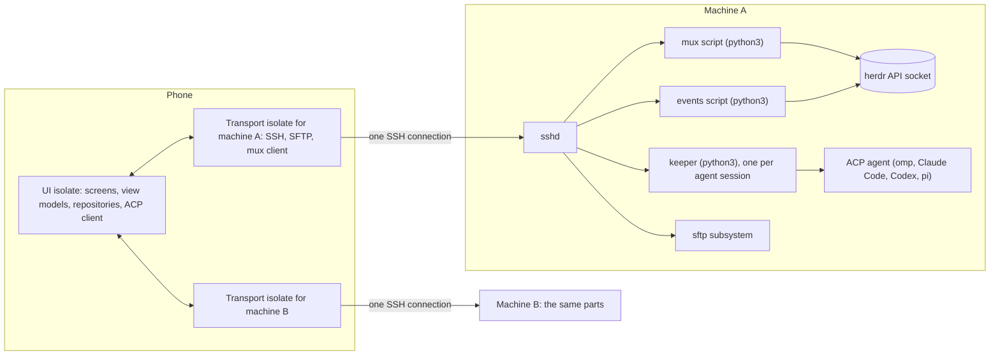

# Architecture

How herdr mobile works, what it runs on your machines, and what it keeps on the
phone. It is written for someone deciding whether to give the app SSH access to
their machines. Every claim names the file it comes from. Paths are relative to
the repository root.

herdr mobile is a Flutter Android app. It supervises coding agents that run
under [herdr](https://github.com/herdrdev/herdr) on your own machines. It has
two kinds of session:

- **Terminal sessions**: herdr panes. The app reads what a pane shows and sends
  keys to it through herdr's API.
- **Agent sessions**: agents that speak the
  [Agent Client Protocol](https://agentclientprotocol.com) (ACP). The app is
  the ACP client, and a small keeper process on the host owns the agent
  (`docs/AGENT_SESSIONS.md`).

## 1. What runs where



On the phone:

- The UI isolate runs the widgets, the view models and the repositories. It
  also runs the ACP client, which parses the agent's JSON-RPC lines
  (`app/lib/data/acp/json_rpc.dart`).
- One transport isolate per machine runs the SSH connection. It handles the
  encryption, the inflating of compressed answers, JSON decoding of herdr's
  answers, and SFTP (`app/lib/data/services/isolate_transport.dart`,
  `app/lib/data/services/transport_factory.dart`).

On each machine:

- **sshd.** The app needs nothing else listening. It opens no ports and installs
  no service.
- **herdr and its API socket.** The app talks to herdr only through that socket.
- **The mux script.** A short python3 program that the app sends with the
  command each time it starts a channel. It serves herdr requests for as long
  as the channel is open, and nothing is installed
  (`app/lib/data/services/bridge_command.dart`).
- **The events script.** Also python3 and also sent with the command. It forwards
  one `events.subscribe` stream (same file).
- **The keeper.** Only if you use agent sessions. It is a python3 file that the
  app installs once per host under `~/.herdr-mobile/`. Each keeper process owns
  one agent process, so the agent keeps running when the phone's connection
  drops (`app/lib/data/services/keeper_script.dart`,
  `app/lib/data/services/keeper_command.dart`).

There is no relay server and no account. The app does not talk to any server
of its own (section 5).

## 2. Connection model

### One connection per machine

Each saved machine gets its own `MachineConnection`
(`app/lib/data/repositories/machine_connection.dart`). Each connection gets
its own transport, created through `createSshTransportLater`
(`app/lib/app.dart:42-67`, `app/lib/data/services/transport_factory.dart`).
The transport runs `SshTransport` inside a worker isolate
(`app/lib/data/services/ssh_transport.dart`). That gives each machine one SSH
connection (one `SSHClient`), with these channels on it:

| Channel | Lifetime | Source |
| --- | --- | --- |
| The mux: every herdr request | Persistent | `ssh_transport.dart` `_startMux`, `mux_client.dart` |
| Events: one `events.subscribe` stream | Persistent while connected | `ssh_transport.dart` `events`, `machine_connection.dart` `_watch` |
| SFTP | Opened on first file use, then cached | `ssh_transport.dart` `_openSftp`, `sftp_files.dart` |
| Keeper commands and attaches | Short commands; at most 4 attached sessions per machine | `ssh_agent_host.dart`, `docs/ENGINEERING.md` "Permission safety" |
| Session log follow (observed omp sessions) | While a screen shows it | `ssh_log_source.dart` |

herdr's socket takes one request per connection. The mux script on the host
takes pipelined JSON requests on stdin and serves each one on its own thread,
over a fresh connection to the socket. Answers can come back out of order; the
client matches them by `id` (`bridge_command.dart:150-153`).

Every channel counts against sshd's `MaxSessions`. When the host refuses one
more channel, only that channel fails. The connection and the other channels
stay up (`ssh_transport.dart:632-648`).

### A request, end to end

1. A view model calls a repository. For example, the pane view calls
   `HerdrApi.readPane` through the machine's `MachineConnection.api`
   (`app/lib/data/services/herdr_api.dart`).
2. `IsolateTransport` posts `['req', id, method, params]` to the machine's
   worker isolate (`isolate_transport.dart:312`).
3. In the worker, `SshTransport.request` hands the request to the shared
   `MuxClient` (`ssh_transport.dart:417-424`). Requests travel as `Q<n>` frames
   of one zlib stream (`MuxRequestEncoder`, `mux_client.dart`).
4. The mux script forwards the request to herdr's socket. It cuts the answer
   down to the fields the app reads (`muxProjections`). For a repeated
   `pane.read` or `session.snapshot` it sends only the rows that changed. It
   deflates any answer over 512 bytes (`bridge_command.dart:30-83`).
5. The worker inflates and decodes the answer and applies the row deltas. It
   posts the result back to the UI isolate as a map.

### Fallbacks when python3 or the socket is missing

The mux and events scripts exit with code 78 when the host has no `python3`, or
when there is no herdr socket at the expected path
(`bridge_command.dart:373-399`). The transport then uses one bridge channel per
request for 30 seconds, and tries the mux again after that
(`ssh_transport.dart:111-117`, `426-443`). The bridge command tries these in
order (`bridge_command.dart:401-446`):

1. `herdr --session <name> remote-api-bridge`, from `~/.local/bin/herdr` or
   `PATH`. It is used only if `remote-api-bridge --check` prints
   `herdr-api-bridge-v1` (herdr 0.9 and newer).
2. `socat - UNIX-CONNECT:<socket>`.
3. A short python3 relay.

If none of these works, the bridge also exits 78. That exit counts as fatal
(`ssh_transport.dart:496-506`), so the machine shows that it needs attention
and the app stops retrying.

### Liveness, reconnect and backoff

- **Link watch.** The transport pings only an idle link: 25 s with a 10 s
  timeout in the foreground, 150 s with a 15 s timeout in the background
  (`app/lib/data/services/link_liveness.dart:27-41`). Any inbound byte counts
  as proof of life. When a ping goes unanswered, the whole connection is reset,
  so every channel ends at once (`ssh_transport.dart:274-308`).
- **Mux heartbeat.** Every 8 s in the foreground and every 120 s in the
  background (`link_liveness.dart`). A mux that stops answering resets the
  connection (`ssh_transport.dart:464-470`).
- **Reconnect loop.** `MachineConnection` retries after 1, 2, 4, 8, 15 and then
  30 s (`machine_connection.dart:38-39`). In the background profile it waits at
  least 30, 60, 120 and then 300 s (`machine_connection.dart:41-44`, `201-209`).
- **Fatal errors stop the loop.** Bad credentials, an unreadable key, a changed
  host key or a missing bridge are fatal. The machine goes to
  `LinkState.attention` and waits for you (`machine_connection.dart:459-461`).
- **Safety poll.** Events drive the updates. A poll catches anything missed:
  every 20 s in the foreground and every 2 minutes in the background
  (`machine_connection.dart:57-58`). Events are throttled rather than
  debounced, because busy agents send them all the time
  (`machine_connection.dart:836-842`).

### Per-machine isolation

Each machine has its own worker isolate, SSH client, reconnect loop and
backoff. A fault in one never touches another. Editing a machine's connection
fields tears down only that machine's connection and builds a new one
(`fleet_repository.dart:185-231`). If a worker isolate dies, it is replaced,
and the requests in flight fail with a retryable error
(`isolate_transport.dart:27-28`).

### Network changes

`ConnectivityNetworkMonitor` (`app/lib/data/services/network_monitor.dart`)
waits 300 ms for the platform's burst of connectivity events to settle. It
reports two things: whether the phone is online, and a signature of the active
interface types (for example `vpn+wifi`). The fleet reacts as follows
(`fleet_repository.dart:320-329`):

- **Offline.** Every machine goes `offline`. Retries stop and the last snapshot
  stays on screen, marked stale.
- **Back online, or a different set of interfaces** (Wi-Fi to cellular, for
  example). Every machine drops its socket and reconnects at once, without
  waiting out a backoff.

Coming back to the app after more than 5 s away also resets the connections,
because sockets die while the app is suspended (`fleet_repository.dart:94-96`,
`276-291`).

### What runs on which thread

The transport isolate does the network, the SSH encryption (dartssh2 encrypts
in pure Dart), zlib, decoding herdr's JSON, the row deltas, SFTP reads, and
uploads (`isolate_transport.dart:20-25`, `docs/ENGINEERING.md` "Files are SFTP,
never a shell"). The cipher order prefers ChaCha20-Poly1305 and AES-CTR,
because AES-GCM measured about 30 times slower in dartssh2
(`ssh_transport.dart:23-46`).

Exec channels (keeper attach, the log follow) cross into the UI isolate as
batches of text lines, collected over at most 8 ms
(`isolate_transport.dart:649-655`). The ACP JSON-RPC lines are then decoded on
the UI isolate (`app/lib/data/acp/json_rpc.dart:329`). Transcript cache writes
(`app/lib/data/services/transcript_cache.dart`), photo preparation
(`app/lib/data/services/image_prep.dart`) and reading a saved key's public half
(`app/lib/data/services/key_generator.dart:109`) each run in their own
short-lived isolates.

## 3. What the app runs on your machine

Everything below runs as the SSH user you configured. The app never asks for
root.

### Commands over SSH exec channels

Every command the app sends is a fixed script, base64-encoded and run as
`sh -c "$(echo <base64> | { base64 -d || base64 -D; })"`. That way any login
shell (fish, csh) passes it through unchanged, and stdin and stdout stay free
for data (`bridge_command.dart:330-333`, `keeper_command.dart:100-105`).

| What | When | What it runs | Source |
| --- | --- | --- | --- |
| Mux | First herdr request on a connection | Checks for `python3` and the socket, then `exec python3 -c '<mux script>' "$S"` | `bridge_command.dart` `buildMuxCommand` |
| Events | One per connection | The same, with the events script | `bridge_command.dart` `buildEventsCommand` |
| Bridge | Only when the mux or events script cannot run | `herdr remote-api-bridge`, else `socat`, else a python3 relay | `bridge_command.dart` `buildBridgeCommand` |
| Keeper install | When a keeper command exits 65 (this app version's script is missing) | A python3 installer. It reads the deflated script from stdin and writes `~/.herdr-mobile/keeper-<version>.py` atomically (directory and file 0700). It removes other versions' files | `keeper_command.dart:69-146` |
| Keeper commands: `probe`, `list`, `start`, `history`, `attach`, `kill`, `follow` | Agent sessions and observed sessions | `exec python3 "$HOME/.herdr-mobile/keeper-<version>.py" '<arg>' ...` | `keeper_command.dart:114-261`, `ssh_agent_host.dart` |

What the keeper itself does on the host (`docs/AGENT_SESSIONS.md` "The keeper"):

- `start` detaches into its own session and starts the agent. That is the
  agent's binary or, if the binary is missing, `npx -y <package>` (which
  downloads the package from npm on the host). The agents are listed in
  `agentRoutes` (`app/lib/data/acp/agent_host.dart:44-71`).
- It listens on a unix socket only. Its state lives in `~/.herdr-mobile/keepers/`
  (directory 0700, files 0600).
- `kill` sends SIGTERM to the agent's process group, then SIGKILL after 3 s. It
  signals only a process whose command line is a keeper script.
- `follow` streams an agent's `.jsonl` session log. It refuses any path that is
  not absolute, not `.jsonl`, or not under the home folder
  (`keeper_command.dart:210-253`).
- If `HERDR_KEEPER_ON_BLOCKED` names an executable, or `~/.herdr-mobile/on-blocked`
  exists and is executable, the keeper runs it when a request starts waiting.
  The app never creates that file.

### Requests through herdr's API

These go over the mux as JSON, never as a shell command line:

- `ping`, `session.snapshot` and `pane.read`, to read state.
- `pane.send_input`, `pane.send_keys` and `pane.send_text`, for what you type
  or tap (`herdr_api.dart:76-97`).
- `workspace.create`, `tab.create`, `pane.split`, the `*.rename` methods and
  the `*.close` methods, for actions you start.
- `events.subscribe`, for the event stream.

### Files over SFTP

Browsing, the file viewer, photo thumbnails and slash-command discovery all
read over the `sftp` subsystem on the same connection (`sftp_files.dart`,
`remote_files.dart`, `app/lib/data/repositories/slash_catalog.dart`). A single
read is capped at 8 MB (`docs/ENGINEERING.md` "Files are SFTP, never a shell").

The app writes only inside `~/.herdr-mobile/inbox/<12 hex>/`. Phone files you
attach to an agent session are uploaded there (folders 0700, files 0600), and
each name is built by the app from a sanitised copy of the file name. Once a
day the app deletes inbox files older than 14 days, at most 200 per sweep, over
SFTP. Nothing outside the inbox is listed or removed
(`app/lib/data/repositories/host_inbox.dart:11-26`, `154-158`,
`app/lib/data/repositories/attach_upload.dart`).

### The sign-in terminal

An agent session can report that the agent needs a login. In that case, and
only when you tap, `SessionLauncher` opens a new herdr workspace with a plain
shell in the session's folder (`workspace.create`, `focus: false`). If the
folder is `~` or under it, the launcher types one line into that shell,
`cd -- "$HOME"/'<rest of the path>'`, because herdr does not expand `~`.
After that, you sign in yourself. The app does not type the login command; it
shows the agent's hint for you to copy
(`app/lib/data/repositories/session_launcher.dart`,
`app/lib/ui/features/agent_session/auth_panel.dart`).

### How input is validated and quoted

Values that end up inside a remote shell command are checked first, then
passed as a single quoted shell word:

- **herdr session name.** Must match `^[A-Za-z0-9._-]+$`; anything else throws
  before a command is built (`bridge_command.dart:5`, `324-328`).
- **Socket path.** Single-quoted (`bridge_command.dart:322`, `381-382`,
  `416-417`).
- **Keeper ids.** Must match `^[a-z0-9]{3,32}$` (`keeper_command.dart:30`,
  `124-128`).
- **Agent ids.** Must be one of `agentRoutes`.
- **Folders and log paths.** Must be non-empty, at most 4096 characters, and
  free of control characters (newlines included). They are then single-quoted
  (`keeper_command.dart:32-38`, `121`, `165-173`, `237-240`).
- **The sign-in `cd`.** Quotes the path after `~/`
  (`session_launcher.dart:3-17`).

Injection tests run the generated commands: `app/test/bridge_command_test.dart`
(session names such as `$(id)`, and a socket path that tries to `touch` a
file), `app/test/keeper_test.dart`, `app/test/keeper_history_test.dart`,
`app/test/log_follower_test.dart` (a log name with quotes, `$()` and
backticks) and `app/test/session_launcher_test.dart`.

Remote paths handled by the file screens and uploads go through SFTP as
protocol arguments and never through a shell. The commands that need a host
path all quote it as described above: the keeper's folder, a session log to
follow, the socket path, and the sign-in `cd`. Text you type into a terminal
pane goes to herdr as a JSON field of `pane.send_input`. It reaches that pane's
program as keystrokes, which is the point, and is never part of an SSH command
line.

## 4. Data model and state

### Fleet, machines and panes

- **`MachineRepository`** holds the saved machines
  (`app/lib/data/repositories/machine_repository.dart`). Profiles are stored in
  `shared_preferences` under `machines.v1`: label, host, port, user, auth
  method, herdr session, socket path, pinned host key, and whether the machine
  is enabled. Secrets are stored separately (section 5).
- **`MachineConnection`** keeps one machine's herdr `Snapshot` (workspaces,
  tabs, panes, agent status) fresh from events and the safety poll. It records
  when each pane entered its status, and whether that time is exact or only a
  bound. A change found after a gap is dated as "at most N minutes ago", not as
  "just now" (`machine_connection.dart:530-541`).
- **"Reviewed" is phone-only.** A finished agent you have looked at shows as
  idle on the phone. herdr is not told (`machine_connection.dart:230-283`,
  `app/lib/data/repositories/reviewed_state.dart`).
- **`FleetRepository`** owns every connection and merges their agent panes into
  one list (`app/lib/data/repositories/fleet_repository.dart`).
- **Observed sessions.** A terminal pane running an agent that names a `.jsonl`
  session log (omp first) can also be shown as a chat. The chat is read from
  that log through the keeper's `follow`
  (`app/lib/data/repositories/observed_sessions.dart`, `app/lib/data/observed/`).

### Agent sessions (ACP)

- **`AgentSessionRepository`** lists keepers per machine. It runs one short
  `list` command every 30 s while the board is visible, and every 90 s in the
  background profile. It holds one `AcpAgentSession` per keeper
  (`app/lib/data/repositories/agent_session_repository.dart`,
  `acp_agent_session.dart`).
- **The protocol layer** is pure Dart in `app/lib/data/acp/`: the client, the
  models, and the `AgentSessionState` reducer with its phases (`idle`,
  `working`, `blockedOnPermission`, `blockedOnQuestion`).
- **The keeper is a liveness helper, not the record.** It keeps a bounded
  in-memory replay log, so a re-attach shows the conversation. The agent's own
  store is the durable record (`docs/AGENT_SESSIONS.md` "The keeper",
  "Durable sessions").

### One "needs you" set

`AttentionSet` (`app/lib/data/repositories/attention_set.dart`) is the single
answer to "does anything need me?". The Agents tab badge, the triage pill, the
board sections, the Machines tab and the notifier all read it.

- It counts terminal panes that are blocked and agent sessions that are
  blocked on a permission or a question.
- It counts only what can be answered from the phone now: the machine must be
  live, and for a session the link too.
- What is out of reach is listed separately as offline and is not counted.
- The lists run longest-waiting first.

### What is cached on the phone, and how stale data is marked

| Data | Where | Source |
| --- | --- | --- |
| Machine profiles, pinned host keys | `shared_preferences` | `machine_repository.dart` |
| Private keys, passphrases, passwords | `flutter_secure_storage` | `machine_repository.dart` `KeychainSecretStore` |
| Last snapshot per machine, with status times (max 512 KB) | `shared_preferences`, `herdr.snapshot.v1.<id>` | `app/lib/data/services/snapshot_cache.dart` |
| Last window of each agent session's transcript (1 MiB per session, 5 MiB total) | App cache directory, `transcripts/` | `transcript_cache.dart` |
| Settings, slash-command usage, quick phrases, the agent screen in front | `shared_preferences` | `app/lib/data/repositories/*_settings.dart`, `slash_usage.dart`, `quick_phrases.dart`, `agent_screens.dart` |

Terminal scrollback beyond what herdr returns is kept in memory only, and only
while the pane is open (`docs/ENGINEERING.md` "Terminal pane").

Stale data is labelled as stale:

- A cached snapshot is painted at start and replaced by the first live one
  (`machine_connection.dart:744-768`).
- An agent on a machine that is not live is `stale`
  (`fleet_repository.dart:35-40`). It is not counted as needing you and cannot
  be answered.
- A session opened from its saved transcript carries `cachedAsOf` and shows
  `Updating…`. While it does, permission and question answers are ignored
  (`docs/ENGINEERING.md` "Opening a thread is instant, and a saved copy is
  never live").

## 5. Security and trust model

### Network traffic

The only socket the app opens is the SSH connection
(`SSHSocket.connect`, `ssh_transport.dart:160`). Checked in the code:

- `app/pubspec.yaml` has no HTTP client, analytics, crash-reporting or
  telemetry dependency.
- Nothing under `app/lib` makes HTTP requests or loads network images.
- The app has no WebView.

Other ways traffic can leave the phone:

- **Links you tap** are handed to the phone's browser through `url_launcher`
  (`app/lib/ui/core/open_link.dart`). A link from a login banner (Tailscale SSH
  approval) opens only if it is `https`. A link tapped in terminal output may
  be `http` or `https`, and the sheet shows the whole address first.
  Addresses that point at the host itself (`localhost`, loopback addresses,
  `.local` names) are copy-only (`docs/ENGINEERING.md` "Links in terminal
  output").
- **`connectivity_plus`** only reads the state of the phone's network
  interfaces (`network_monitor.dart`).
- **Notifications** are local, through `flutter_local_notifications`
  (`app/lib/data/services/local_notifier.dart`).

On the host, two things can reach the network that are not the app's own
traffic: a keeper that starts an agent through `npx -y` downloads it from npm,
and the optional ntfy plugin, if you install it, posts from the host to an
ntfy server (`docs/ALERTS.md`, part 2). The app does not use or configure that
plugin.

Android permissions (`app/android/app/src/main/AndroidManifest.xml`):

- `INTERNET`.
- `POST_NOTIFICATIONS`.
- `FOREGROUND_SERVICE` and `FOREGROUND_SERVICE_SPECIAL_USE`, for the Watching
  notice.
- `WRITE_EXTERNAL_STORAGE`, on Android 9 and below only, for saving a photo.
- `READ_MEDIA_IMAGES` and `READ_MEDIA_VISUAL_USER_SELECTED`, for the attach
  sheet's gallery. They are asked for only when you open that tab.

### Host keys: trust on first use, hard stop on change

dartssh2 reports the host key as an OpenSSH-style `SHA256:` fingerprint.

- **First connection.** With no pin saved, the key is accepted and pinned
  (`ssh_transport.dart:209-219`). The pin is saved with the profile
  (`machine_repository.dart:180-190`). After a successful **Test**, the machine
  form shows the fingerprint, so you can compare it with
  `ssh-keygen -lf /etc/ssh/ssh_host_*.pub` on the host
  (`app/lib/ui/features/machines/machine_form_screen.dart:763-769`).
- **Any later mismatch.** The handshake is refused and the error is fatal
  ("Host key changed since it was first trusted"). The machine stops retrying
  and shows `attention` (`ssh_transport.dart:17-21`, `247-249`).
- **Changing the pin.** Changing the host or port in the form drops the pin
  (`machine_form_view_model.dart:242-247`). Otherwise, remove the machine and
  add it again.

### Credentials

- **Supported methods.** A private key (OpenSSH PEM, with an optional
  passphrase), a password, or no credential for Tailscale SSH, which uses only
  the `none` method (`ssh_transport.dart:167-196`). The app requests no agent
  or port forwarding.
- **Storage.** Keys, passphrases and passwords live in `flutter_secure_storage`
  under `machine.<id>.<field>`, never in preferences
  (`machine_repository.dart:45-83`).
- **Use.** They are read from the keychain only when a transport starts. They
  are handed to that machine's worker isolate in memory
  (`transport_factory.dart:18-48`).
- **Generating a key.** The app generates Ed25519 keys on the phone from
  `Random.secure()`, and zeroes the seed after use. The public line carries the
  comment `herdr-mobile@<label>`, with the label reduced to characters that
  are safe to paste into a shell. The object's `toString` never prints the
  private half (`app/lib/data/services/key_generator.dart:40-64`, `141`).

### Nothing is approved automatically

Terminal prompts:

- **The command is shown.** Prompts are detected from the screen
  (`app/lib/data/repositories/prompt_detector.dart`). A one-tap answer shows
  the command or path it approves.
- **Risky answers are held.** Answers judged risky (a push, a delete, a
  standing "don't ask again" grant) must be held, not tapped
  (`app/lib/data/repositories/command_risk.dart`,
  `app/lib/ui/core/hold_confirm.dart`).
- **The question is read again first.** Before an option is sent, the pane is
  read again. The keys go only if the pane still asks the same question,
  matched by a digest of the question, its subject and its options
  (`app/lib/ui/features/agents/quick_reply_controller.dart:41-45`,
  `app/lib/data/repositories/pane_answerer.dart:16-42`).
- **Stale taps are ignored.** An answer control that just appeared or moved
  ignores taps for 450 ms (`app/lib/ui/core/tap_guard.dart:5-9`).
- **Batch actions skip blocked agents.** They never type into a blocked
  terminal agent unless `Send anyway` is on, which is off by default, and never
  into a blocked agent session (`docs/ENGINEERING.md` "Batch actions").

Agent sessions:

- **The app has no default answer.** `AcpClientHandler` has no default
  implementation (`app/lib/data/acp/acp_client.dart`). `AcpAgentSession`
  answers only through `answerPermission` and `answerQuestion`. Cancelling,
  ending or disposing a session answers `cancelled`.
- **The keeper never answers.** Pending requests wait in its table until a
  client answers (`docs/AGENT_SESSIONS.md` "The keeper", item 4).
- **Risky modes are named.** A session mode that lowers the agent's guard
  (accept edits, no asking at all) is labelled with its risk
  (`app/lib/data/decision/mode_danger.dart`).

Notification buttons:

- A notification gets buttons only for options that need neither a confirm nor
  a standing grant (`pane_answerer.dart:44-48`).
- Before sending, a press re-reads the pane and checks the same question digest
  (`docs/ALERTS.md` "Answer from the notification").

### Notifications are local only

Notifications are off by default. They are built and posted on the phone from
the state the phone already holds; no push service is involved
(`app/lib/data/repositories/attention_notifier.dart`, `local_notifier.dart`,
`docs/ALERTS.md`). A notification can show an agent's question and command. The
app does not set a lock-screen visibility for it, so Android's own lock-screen
setting decides whether that text appears there.

### Threat model

**A compromised or stolen phone.**

- *Can:* if it is unlocked, or an attacker can run code as the app, they get
  the saved keys and passwords. That gives a shell as your user on every saved
  machine, as with any SSH client that stores credentials. They can also read
  the cached snapshots and transcripts.
- *Cannot:* reach anything the SSH user cannot reach. The app holds no other
  credentials and has no server account.
- *Revocation:* remove the phone's public key from `~/.ssh/authorized_keys` on
  each host (generated keys end in `herdr-mobile@<label>`).

**A compromised host.** It already runs your agents.

- *Can:* send any terminal text, ACP message or file content to the app,
  including a misleading prompt. The app shows the command an agent asks
  about, but it cannot check that the agent's description is true. If you use
  password authentication, the host's sshd receives the password. A host can
  also read anything you upload to its inbox.
- *Cannot:* run code on the phone. The app renders text, Markdown and images,
  with no WebView. It cannot open a link without your tap, and a link from a
  login banner must be `https`.
- *Cannot:* reach other machines through the app. Each machine has its own
  connection and isolate, and the app does not forward agents or ports.
- *Cannot:* read phone files you did not attach, or answer a prompt for you.
- *Limits on what it can send:* reads are capped (8 MB per SFTP read), and the
  keeper's log has byte bounds.

**A network attacker.**

- *Can:* see that the phone connects to the host, observe traffic volume and
  timing, and drop the connection.
- *Can, on the first connection only:* impersonate the host, because the first
  key is trusted. Compare the fingerprint shown after Test.
- *Cannot:* read or change traffic, which is SSH-encrypted. After the first
  connection, a different host key stops the connection for good.

## 6. Background behaviour and battery

**With notifications off (the default).** When the app goes to the
background, the connections stay up for 90 s, and the agent sessions detach
after 90 s too. Then every connection is torn down until you come back
(`fleet_repository.dart:69-70`, `293-306`, `docs/ENGINEERING.md` "Agent
sessions (ACP)"). The keeper keeps the agents running on the host meanwhile.
Back in the foreground, the app reconnects or refreshes.

**With notifications on, and at least one reachable agent working or blocked.**
The app runs a `specialUse` foreground service. It shows a minimum-importance
notice, "Watching N agents" (`attention_notifier.dart:83-90`,
`local_notifier.dart:243-285`). While it runs, the connections are kept, and
they switch to the background profile (`machine_connection.dart:187-199`,
`docs/ALERTS.md`):

- The event stream carries status changes only (one
  `pane.agent_status_changed` per agent pane, plus structural events).
  `pane.updated`, which fires for every spinner frame, is not subscribed.
- The mux heartbeat goes from 8 s to 120 s. The idle link ping goes from 25 s
  to 150 s. The safety poll goes from 20 s to 2 minutes.
- Agent sessions are listed every 90 s. A streaming session updates the app at
  most every 2 s. A machine that is down is retried at most every 5 minutes.

The service stops when nothing is working or blocked, or when you turn the
setting off. It also stops when the app is swiped away (`stopWithTask` in the
manifest, `MainActivity.onDestroy`). At the root screen, Back moves the app to
the background instead of closing it while watching
(`app/lib/data/services/task_mover.dart`). The battery cost of watching has
not been measured (`docs/ALERTS.md` "Limits, plainly").

## 7. Code layout

The layering is `ui/` → view models → `data/repositories` → `data/services`.
Widgets do not hold transports. View models are `ChangeNotifier`s next to their
screens, and they receive repositories through `provider` (`app/lib/app.dart`).
One exception: the machine form's view model opens a short-lived transport for
**Test** through an injected factory
(`app/lib/ui/features/machines/machine_form_view_model.dart:42`, `291-339`).

```
app/lib/
  main.dart, boot.dart   start-up; stores loaded before runApp
  app.dart               root: providers, routes, theme, deep links
  data/
    services/            transports and host I/O: herdr_transport.dart (interface),
                         ssh_transport.dart, isolate_transport.dart,
                         transport_factory.dart, mux_client.dart,
                         bridge_command.dart (mux, events, bridge scripts),
                         herdr_api.dart, keeper_script.dart, keeper_command.dart,
                         ssh_agent_host.dart, ssh_log_source.dart, sftp_files.dart,
                         remote_files.dart, key_generator.dart, network_monitor.dart,
                         link_liveness.dart, local_notifier.dart, caches
    repositories/        machine_repository.dart, machine_connection.dart,
                         fleet_repository.dart, attention_set.dart,
                         attention_notifier.dart, agent_session_repository.dart,
                         acp_agent_session.dart, observed_session(s).dart,
                         command_risk.dart, prompt_detector.dart, pane_answerer.dart,
                         host_inbox.dart, session_launcher.dart, settings stores
    acp/                 ACP client, models, session reducer (pure Dart)
    observed/            agents in herdr panes read from their session logs
    decision/            rules for what the person is asked to judge
    models/              herdr snapshot and pane models, machine profile
    streaming/           when a streaming session notifies, reveal pacing
  ui/
    core/                design system, terminal view, Markdown, deep links,
                         hold and tap guards
    features/            one folder per screen family, with view models:
                         agents, agent_session, pane, files, machines, create,
                         history, attach, photos, settings
    shell/               the three root tabs
```

`docs/DEVELOPMENT.md` "Code layout" has the full listing. `docs/ENGINEERING.md`
has the facts behind each subsystem, and `docs/DESIGN.md` describes the design
system.

## 8. Testing

- **Unit and widget tests** live in `app/test/` (210 test files). They cover
  behaviour, boundaries, transitions and errors. Fakes are in
  `app/test/support/`: a fake transport, a fake SFTP server, a fake network,
  and a fake ACP agent (`fake_acp_agent.py`).
- **Real host-side code under test.** The keeper tests run the real keeper
  script against a scripted agent (`app/test/keeper_test.dart`,
  `app/test/support/keeper_process_host.dart`). The bridge tests run the
  generated shell and python commands against a local unix socket
  (`app/test/bridge_command_test.dart`).
- **Schema check.** `herdr_api_test.dart` checks the event subscription list
  against `docs/herdr-api.schema.json`.
- **Captured, not written.** Agent prompts change often, so test inputs come
  from real agents:
  - `tool/capture-prompt.sh` saves a real herdr pane as a prompt fixture
    (`app/test/fixtures/prompts/<agent>/`).
  - `tool/capture-trace.sh <omp|claude|codex|pi|all>` runs a real agent on a
    tiny turn in a scratch directory and records every JSON-RPC line with its
    time. Fixtures are redacted, and live in
    `app/test/fixtures/traces/<agent>/` (omp, Claude Code and Codex today).
  - The reducer, transcript plan and screen replay tests replay those traces.
- **Screens.** Screens are rendered to PNG with worst-case data through
  `app/test/support/shot.dart`.
- **Phone-only measurements.** Benchmarks are in `app/benchmark/`. The
  keyboard and streaming measurements run on a real phone over adb
  (`autoresearch.sh`, `autoresearch-stream.sh`).
- **One command.** `tool/check.sh` runs `pub get`, the analyzer and the tests.
