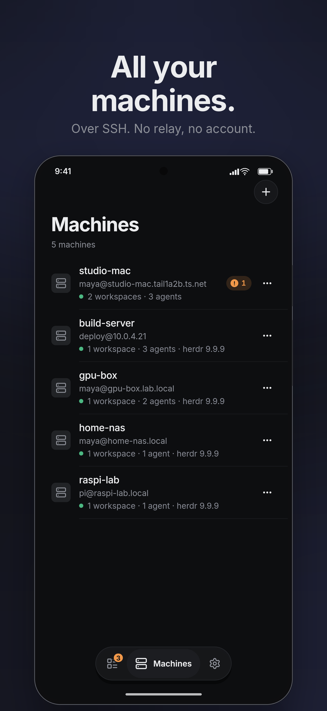
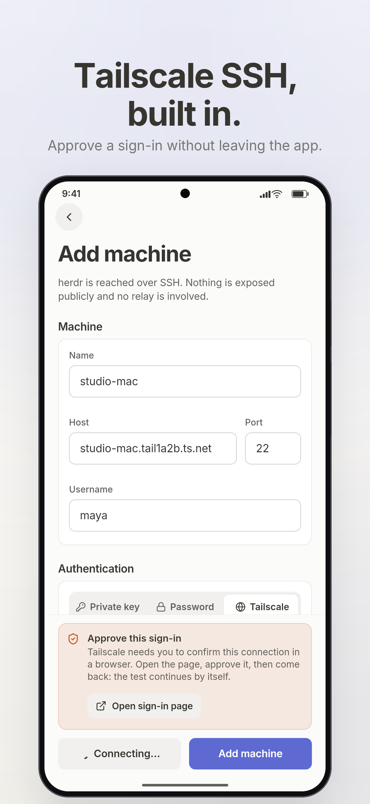
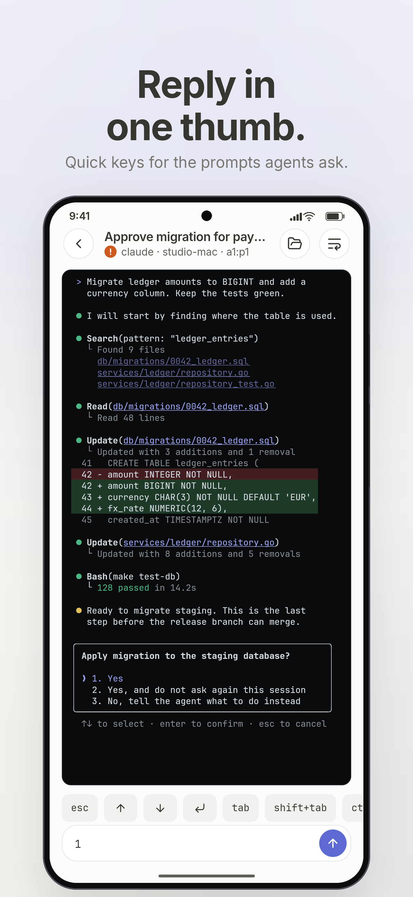
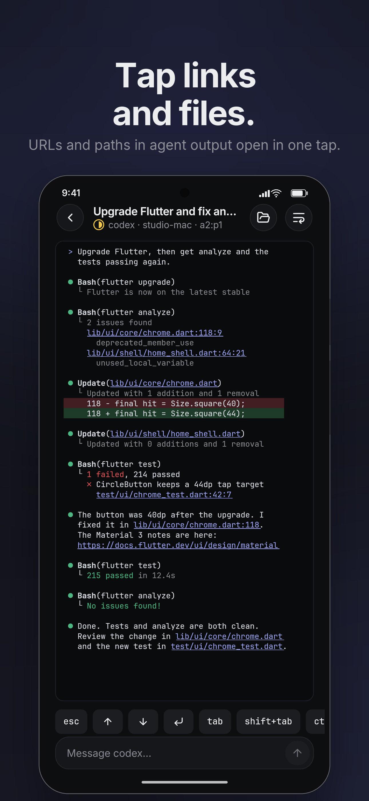
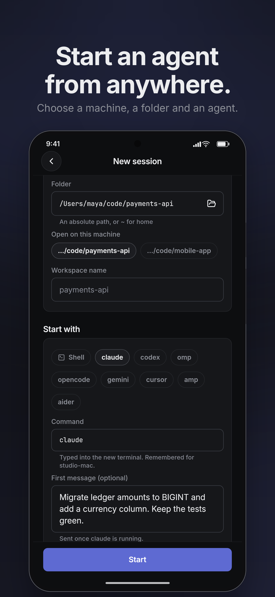
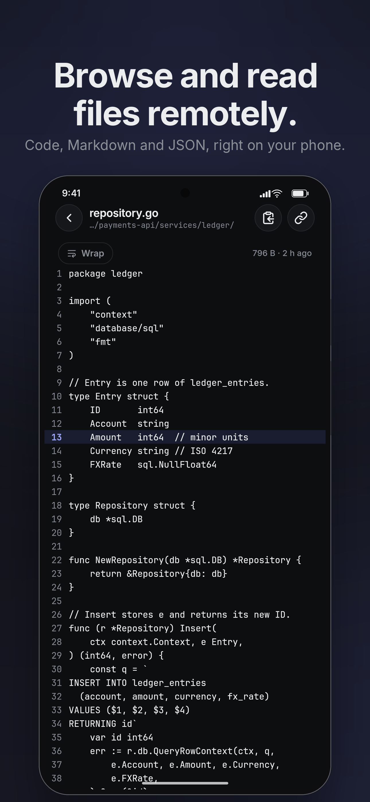
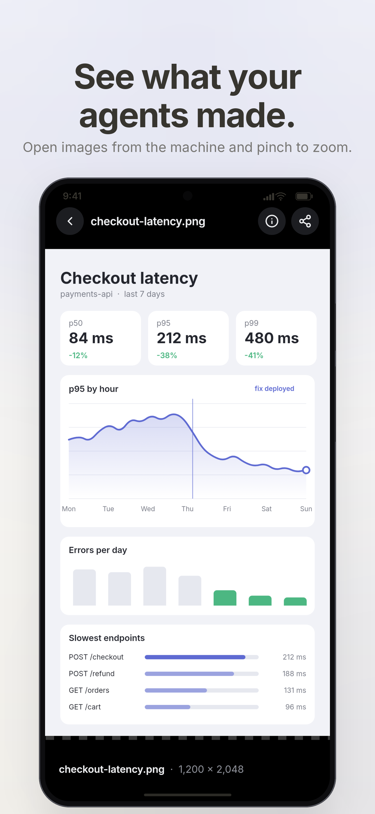

# herdr mobile user guide

This guide is for people who install herdr mobile 0.1.0 and use it to look
after coding agents that run under [herdr](https://herdr.dev) on their own
machines. It follows the order you meet things: set up, look at the board,
answer, watch and steer, then the details (files, notifications, errors).

Words set in code style are the exact labels on screen.

## 1. What you need

**A phone.** Android 7.0 or newer, 32- or 64-bit ARM. Releases ship an
Android APK only.

**On each machine:**

- **sshd**, reachable from the phone: on the same LAN, over a VPN, or over
  Tailscale. There is no relay and no public port; if the phone can't reach
  the machine's SSH port, the app can't either.
- **herdr, running.** The app talks to herdr's API socket over SSH, so herdr
  must be up and its socket present.
- **A POSIX shell.** Windows hosts are not supported.

**herdr versions and fallbacks.** The app needs one of these on the machine
to reach herdr's socket:

| On the machine | What the app does |
| --- | --- |
| `python3` | Runs a small script that keeps one persistent, compressed channel for every request. This is the fast path. |
| herdr 0.9 or newer (`herdr remote-api-bridge`) | Used when there is no `python3`, one channel per request. Also needed for named herdr sessions. |
| `socat` | Used on older herdr without `python3`, one channel per request. |

With herdr older than 0.9 the app can only reach the default herdr session,
at `~/.config/herdr/herdr.sock`, unless you give the socket path under
`Advanced` (see below). Log in as the user that runs herdr: the socket is
looked for in that user's home.

**Agent sessions** (agents you start from the phone, section 6) also need
`python3` (3.6 or newer) on the machine, and the agent itself installed there:
`omp`, or Node's `npx` for Claude Code, Codex and pi.

**Files** need the sshd `sftp` subsystem, which most sshd setups have enabled.

## 2. Install

1. On the phone, open the
   [Releases page](https://github.com/tuan3w/herdr-mobile/releases) and download
   `herdr-mobile-<version>.apk`. One APK covers every supported phone.
2. Optional but recommended: check the download. Each release has a
   `SHA256SUMS` file. On a computer, put both files in one folder and run:

   ```sh
   sha256sum --check --ignore-missing SHA256SUMS
   ```

   It must print `herdr-mobile-<version>.apk: OK`.
3. Open the APK. Android asks you to allow installs from this source (the
   browser or file manager you opened it with). Allow it, then install.
4. Later releases install over this one and keep your machines and settings.
   You do not have to come back to this page: when a new version is out,
   Settings gets a small dot. Open it, read What's new, tap Download, then
   Install. herdr checks the file against the release's checksum first, and
   Android asks you to confirm. The first time, Android also asks you to allow
   herdr to install apps: allow it and tap Install again. Settings > About >
   Check automatically turns the automatic look off (then Check for updates
   asks on demand).

## 3. Add a machine



On first start the Agents tab shows `Add your first machine`. Later, use the
`+` on the Machines tab (`Add machine`).

1. Under `Machine`, fill in:
   - `Name`: what the app calls it (for example `Build server`). Blank uses
     the host.
   - `Host` and `Port`: the address the phone can reach (a LAN address, a
     VPN address or a Tailscale name), and the SSH port (22 by default).
   - `Username`: the SSH user, the one that runs herdr.
2. Under `Authentication`, pick one:
   - `Private key`: paste a key into `Private key (PEM / OpenSSH)` (the
     paste button is next to the field), and its `Key passphrase (if any)`.
     Or generate a new key on the phone (below).
   - `Password`: the SSH password.
   - `Tailscale`: Tailscale SSH. Nothing is stored; Tailscale already knows
     the phone. The Tailscale app must be connected. If your tailnet asks for
     an extra check, the app shows `Approve this sign-in` with a link: open
     it, approve, and come back; the test carries on by itself. The machine
     must run Tailscale SSH. The Tailscale apps for macOS (App Store and
     Standalone) cannot, so a Mac answers as its own OpenSSH (Remote Login):
     pick `Private key` or `Password` for it and use its Tailscale address as
     `Host`.
3. Tap `Test connection`. On success it shows `Connected · herdr <version>`,
   the number of workspaces and the host key.
4. Tap `Add machine` (on an existing machine, `Save`).



**Generating a key on the phone.** With `Private key` chosen, tap
`Generate key`. The app makes an Ed25519 key, fills the field and shows the
`Public key` with two buttons:

- `Copy public key`: the `ssh-ed25519 AAAA… herdr-mobile@<name>` line, for
  places that take a public key (Tailscale, GitHub).
- `Copy authorized_keys command`: a one-line command to run once on the
  machine, from a session you already have:

  ```sh
  mkdir -p ~/.ssh && chmod 700 ~/.ssh && echo 'ssh-ed25519 AAAA… herdr-mobile@<name>' >> ~/.ssh/authorized_keys && chmod 600 ~/.ssh/authorized_keys
  ```

Run the command on the machine, then `Test connection`, then save. A
generated key exists only on this phone, so the form asks before Back
discards it. On a saved machine, `Show public key` shows the public half
again.

**Host keys.** The first successful connection pins the machine's host key
(trust on first use). If the key later changes, the machine stops with
`Host key changed since it was first trusted. Re-add the machine if the
change is expected.` Expected reasons: you reinstalled the OS or regenerated
the host keys. If you did not, treat it as a warning that something between
the phone and the machine is not what it was, and do not reconnect until you
know why. To accept a new key, remove the machine and add it again.

**Advanced.** Two optional fields:

- `herdr session`: a named herdr session. Named sessions need herdr 0.9+ on
  the machine. Blank means the default session.
- `API socket path (optional)`: only used when herdr lacks
  `remote-api-bridge`. Set it when herdr's socket is not where the app looks
  by default.

**Managing machines.** On the Machines tab each machine shows its state. Its
`More` menu has `Edit`, `Disable` (stop connecting without deleting it) and
`Remove` (deletes the connection and its credentials from the phone). Tap a
machine to see its workspaces, tabs and panes; `Browse files` and the `+`
(`New agent session` on that machine) are at the top.

## 4. The board


The Agents tab is the board: every agent on every machine in one list. It
holds both kinds of agent:

- **Terminal agents**: agents running in herdr panes, as herdr sees them.
- **Agent sessions**: agents started from the phone (section 6).

**Sections.** Agents are grouped by what they need, in this order:

- `Needs you`: blocked on a question or a permission. Longest waiting first.
- `Working`
- `Done`: finished and not yet reviewed. Longest waiting first.
- `Idle`: agents and phone sessions together, by recency: those that stopped
  within the last day, newest first; then those the app has no date for; then
  the older ones, newest first. The first five show; the rest sit behind one
  line (`22 more idle`, with the names of the first two under it) that opens
  them in place and then reads `Show fewer`. The `Idle` chip shows them all.

Tap a section header to fold it. The chips under the title filter the board
to one status.

**When an idle agent stopped.** herdr gives no timestamps, so the app dates a
change when it sees it. An agent that was already idle when the app first
looked has no date of its own; an omp agent whose session is reported (see
below) is dated by when its session file was last written, which is when its
last turn ended. A phone session is dated by when it last did anything. An
agent with no date was idle before the app first looked, so it may be an hour
old or a month: it sits between the ones that stopped within a day and the older
ones, in machine and pane order, rather than under them.

**What an agent is called.** The name you gave the pane in herdr, else the
title the program set. An omp pane whose title is only its folder (omp shows
`π > <folder>` until it has a title for the session) is named from its session
log: the session's own title, else your last message in quotes
(`“Add a regression test”`: what you asked, not the agent's name for it). This
needs herdr's omp integration on the machine (`herdr integration install omp`),
which is what tells herdr, and so the app, where the log is. Without it the
title stays the folder. The log is read over SFTP (the head and the tail of the
file) when a pane needs a name and again when its status changes, never while
the app is in the background. An idle omp pane with a good title costs one
`stat`, for the date above.

**Cards or compact.** Cards show the last lines of the agent's terminal and
how long it has been in its state; the compact list shows one row per agent.
Switch with the button in the header (`Compact list` / `Cards with preview`),
or pick a default in Settings > Look > `Agent list`: `Auto` (cards up to
four agents, compact from five), `Cards` or `Compact`. A blocked agent always
keeps its answers.

**The count.** One number answers "does anything need me?": the badge on the
Agents tab, the `Needs you` section, the triage pill and the notifications all
count the same set. It counts only agents you can answer now: an agent on a
machine that is offline is listed, dimmed and marked `offline`, but not
counted (the section header says `2 offline` instead).

**The triage pill.** While anything needs you, a pill floats above the tab bar:
`2 need you · 3 to review`. Tap it to walk through every waiting agent, one
at a time, longest waiting first (`1 of 2 need you`, `Previous agent`,
`Next agent`). A terminal agent shows its answers and a message box; an agent
session shows what it asks and `Answer in the session`. When the last one is
answered the sheet says `All clear`.

**Reviewing finished work.** A finished agent stays in `Done` until you
review it:

- Swipe a done card or row left until it shows `Reviewed`, or flick it.
- `Mark all reviewed` on the `Done` header reviews every finished agent you
  can reach.
- Opening a finished agent session reviews it.

Each shows a `Marked reviewed` toast with `Undo`. This is a mark on the phone
only; herdr's own state is not touched.

**Selecting several agents.** Long-press a card or row to start selecting;
taps then add or remove agents (`All` and `Cancel` are at the top,
`Select all` on the `Done` header). The bar at the bottom offers:

- `Interrupt`: sends Esc to each terminal agent and stops the turn of each
  agent session.
- `Message`: one message typed into each agent, then Enter.
- `Close`: closes the terminal panes and ends the agent sessions. This
  cannot be undone.

Each opens a confirm sheet built from live data that lists what will be
affected and what is skipped. An agent that is waiting on a question is
skipped and listed under `Waiting for an answer (skipped)`; for terminal
agents you can switch on `Send anyway` (off by default). A waiting agent
session is never typed into.

**Pull to refresh** reconnects every machine. The `+` in the header starts a
`New agent session`; the history icon next to it opens `Past sessions`.

## 5. Answering an agent



**One-tap answers.** When a terminal agent asks a question the app
understands, its options appear as chips on the card, with the command or
path it asks about under the question. Tap an option to send it. When there
are more than five options, the last chip on the card is `N more…`, which
opens the reply sheet with all of them. The reply button on a card
(`Reply to <agent>`) opens the same sheet, with a message box
(`Message the agent…`) and `Open full` for the agent's screen.

Agent sessions on the board say what they ask but are answered inside the
session (open it, or `Answer in the session` from the pill).

**Hold for risky answers.** An answer that does something hard to take back
(a push, a delete) or grants standing permission ("don't ask again",
"always allow") is not sent by a tap. Press and hold it (about 0.7 s); the
chip fills, and releasing early sends nothing. A tap only shows the reason,
for example `Hold to send · pushes to a remote`. The reason is a hint, not a
guarantee: always read the command, which stays on screen.

**Why taps are sometimes ignored.** Answers that just appeared, changed or
moved (a card above them came or went, the card grew) ignore taps for about
half a second and are dimmed meanwhile. This stops a tap aimed at one
question from landing on the next one that slid under your thumb.

**The app checks before it sends.** Before sending, the app reads the
agent's screen again. If the question is no longer the one you saw (you
answered it on your desktop, the agent moved on), nothing is sent and the
chip says `The question changed`. The new question shows at once.

**Agent session requests.** In an agent session the request appears in a
dock above the message box. It always shows the command or input in full,
plus what the agent said just before asking and any diff or plan it carries.
The buttons are the agent's own options; risky ones need a hold, as above.

- A command too long for the box shows `More below · N lines` and
  `Read all`, which opens it in full. If you haven't scrolled to its end, the
  first hold on an allow option scrolls there instead of sending
  (`Hold to send · long command, read it all`).
- A new request ignores taps for about half a second.
- `Cancel request` answers it as cancelled. Questions with a form have
  `Accept` and `Decline`.
- `N more waiting` means more requests are queued behind this one.

**Undo.** Reviews can be undone (section 4). Answers can't: once an answer
is sent, the agent has it. That is why risky answers are held and the app
checks the question before sending.

## 6. Watching and steering

Tap an agent on the board to open it. A terminal agent opens as its live
terminal; an agent session opens as a chat. Back always returns to the board.

**Swiping between agents.** On an agent's screen, a quick sideways swipe goes
to the next agent in board order (left for next, right for previous). Swipes
that start at the screen's edges are left to Android's back gesture, and
anything that scrolls sideways (a wide table, a terminal with wrap off) keeps
its swipe. At either end of the list nothing moves. When the app is
restarted, it reopens the agent screen that was in front.

### The terminal pane


The pane shows the agent's terminal in colour, with up to 1,000 rows of
scrollback (herdr's limit). It is text only: no cursor or mouse.

- **Bar.** `Browse files` (the pane's folder), the wrap button
  (`Wrap lines to screen` / `Show exact terminal layout`) and `Pane options`:
  `Duplicate` (start an agent session with the same machine, folder and
  agent), `Copy title`, `Copy pane id <id>`.
- **Width.** herdr can't resize a pane to the phone over its API, so a wide
  pane is either pinch-zoomed or re-flowed by wrap. Wrap keeps table and box
  rows whole and scrolls them sideways. Default font size and wrap are in
  Settings > Look.
- **Message box.** Type and send: the text goes to the pane as a line.
- **Key row** (`Show keys` / `Hide keys`). Keys a phone keyboard lacks. For
  an agent: esc, arrows, Enter, space, new line, `/`, `@`, ctrl, alt, tab,
  shift+tab, ctrl+c. For a shell: esc, arrows, Enter, ctrl, alt, tab, ctrl+c,
  ctrl+d and `/ ~ - |`. Holding an arrow repeats it.
- **Ctrl and Alt** apply to the next key only: tap ctrl, then type `r`, and
  the pane gets ctrl+r.
- **Slash palette.** Type `/` at the start of the message box in an agent
  pane to list the agent's commands. A tap fills in the command; you still
  send it. Long-press a command to pin it; pinned and recently sent commands
  come first.
- **Quick phrases.** Chips above the empty message box. A tap fills the box
  and never sends. Edit them in Settings > Agents > `Quick phrases`. Up to three
  messages you send to an agent at least twice join them, most sent first
  (before the built-in phrases while you have not edited the list). They are
  learned and kept on this phone only; turn that off or forget them in the
  same place.
- **Dictation.** While the message box of an agent is empty, the mic sits
  where Send is. Tap it and speak: the words appear in the box as you speak
  and nothing is sent. Tap again to stop, or pause. A long press picks the
  language (English, Tiếng Việt, the phone's own, or one you chose before);
  a listen is one language, so a sentence that mixes two is understood in
  one. The phone's speech service may send the audio to Google unless an
  offline language is installed in it. The first tap asks for the
  microphone.
- **Answer dock.** When the agent asks a question the app understands, it
  shows above the key row with up to three answers. While it is shown, a bare
  Enter is not sent (`Pick an answer above`), because Enter would pick
  whatever option the agent has highlighted.
- **Links.** Web addresses and file paths in the output are underlined. A
  web link opens a sheet with the full address, `Open in browser` and
  `Copy link`; an address that lives on the machine (like `localhost`) can
  only be copied. A file path opens the file viewer.
- **New output.** Scrolled up, a pill counts new lines (`3 new lines`) or says
  `Needs you`; tap it to jump to the end.



### Agent sessions


An agent session is an agent the phone starts and talks to over the Agent
Client Protocol ([ACP](https://agentclientprotocol.com)) instead of reading
its screen. The agent runs inside a small keeper process on the machine, so
it keeps working when the phone's connection drops, and the app reattaches
when it can.

**Starting one.** Tap `+` on the Agents tab (or on a machine's screen) to open
`New agent session`:



1. Under `Where`, pick the machine and type a `Folder` (an absolute path, or
   one starting with `~`), or browse to it. Folders used before are offered
   below the field.
2. Under `Agent`, pick `omp`, `Claude Code`, `Codex` or `pi`. An agent that
   isn't installed on the machine is dimmed with the reason.
3. Tap `Start` (stay where you are; the toast has `Open`) or
   `Start and open`.

`Past sessions` lists conversations an agent kept on a machine, to continue
one.

**At the computer.** When herdr runs on the machine, each agent session also
gets a tab in a herdr workspace called `Phone sessions`. herdr lists it with
the other agents (working, blocked or idle), on that machine and on any
computer connected to it. The tab shows the conversation: type a line and
press Enter to send it, type the number of an option to answer a permission,
`/cancel` stops the turn and `/quit` closes the view (the agent keeps
running). Questions with a form are answered on the phone. The phone and the
terminal share the session: whichever answers first wins, and the other says
who answered. Ending the session on the phone closes the tab. To turn the
tabs off on a machine, create the file `~/.herdr-mobile/no-panes` there.

How well each agent is tested:

| Agent | Status |
| --- | --- |
| omp | Verified end to end, including from the phone. |
| Claude Code | One full turn with a permission request checked through the app's own client on a desktop; not verified on a phone. |
| Codex | Chat checked through the app's client; approvals and tool rows unverified. |
| pi | Built and unit-tested; no successful turn verified. |

**The transcript.** Each turn shows your message, then the agent's work as
one folded line (`Worked 42s · 3 files · 4 commands`, tap to open), a
`Changed` card listing the files it edited (tap a file for its diff), then the
answer. Failed or cancelled steps stay visible outside the fold. While a turn
runs, a status line says what the agent is doing and for how long, and
`Quiet for 2m` when nothing has happened for a while.

**Plans.** When the agent has a plan, a header shows the step it is on
(`1 of 3`). `Session options` > `Session overview` shows the goal, plan,
changed files, commands, mode and model, and context use.

**Sending while it works.** The message box stays open. omp and pi queue a
message until the turn ends (the send button becomes `Queue`); Claude Code and
Codex take it into the running turn. Queued messages show above the box; tap
one to edit or remove it.

**Stop.** While a turn runs, `Stop` sits next to the send button. It ends the
turn only. Messages waiting in the queue go out together, as one message, as
soon as the turn has stopped (you queued them to follow this turn; stopping it
is going on with them). A turn that fails, or is stopped from somewhere else,
holds them instead, with `Resume`. Work the agent started in the background
keeps running: a strip above the message box shows it, and the `Background
work` sheet lists each job with its own Stop (`Hold to stop`).

**Attachments and photos.** The paperclip opens the attach sheet with three
tabs:

- `Gallery`: photos on the phone, plus `Take a photo`. An agent that does not
  take images gets photos as files.
- `Files`: any phone file (`Choose files…`), up to 200 MB. It is uploaded to
  `~/.herdr-mobile/inbox/` on the machine and the agent gets its path.
- `Host`: files already on the machine, starting with ones changed recently.

Up to five attachments per message. The message can't be sent until every
upload has finished; a failed upload keeps its chip with `Retry`.

**Modes.** Mode and model chips sit above the message box. A mode that skips
permission checks is shown in the danger colour, and switching to it needs a
hold.

**Signing in.** If the agent needs a login on the machine, the session shows
`Sign in on the host` with the agent's login command (`Copy command`) and
`Open a terminal on <machine>`, which opens a plain shell in the session's
folder. The phone never logs in for you. On a Mac, Claude Code keeps its login
in the Keychain, which macOS opens only for programs of your desktop session. The
phone starts Claude's sessions inside that session, so your subscription login is
found without a token, as long as you are logged in at the Mac. If nobody is
logged in there, or you set a token yourself, the session is started the old way
and the panel can say `Claude Code needs a token`: run `claude setup-token` on
the Mac, add `export CLAUDE_CODE_OAUTH_TOKEN=<token>` to `~/.zshenv`, and start
a new session.

**When the session ends.** If the keeper is gone (the machine restarted), the
session shows `Session ended` and its saved transcript, read-only. `Continue`
resumes the conversation where the agent supports it.

### Show terminal / Show chat

An omp, Claude Code or Codex agent running in a herdr pane can be read both
ways: as its terminal, or as a chat built from the agent's own session log.
Switch with `Show chat` in `Pane options` or `Show terminal` in `Session
options`. The choice is remembered for that agent until the app restarts; the
default is in Settings > Agents > `Open agents as`. Other terminal agents
have only the terminal.

The chat needs the app to find the agent's log. omp tells herdr where it is.
For Claude Code and Codex, herdr's hook has to report the session: if the
terminal's `Pane options` offers `Read as chat…`, tap it and confirm to install
the hook on that machine (the same as `herdr integration install claude` or
`codex`), then restart or resume the agent. A Claude Code that was already
running without the hook still opens as a chat when the app can recognise its
process; a Codex session cannot be found without the hook, because Codex keeps
no record of which process runs which session. In the chat you can read the
whole conversation, answer approvals from the card, answer Claude Code's
questions, stop a turn, send a message, and see subagents and background
tasks.

## 7. Files



Open the file browser from a pane (`Browse files`), a machine's screen, an
agent session (`Session options` > `Files`), or by tapping a path in a
terminal or chat. Files are read over SFTP; nothing is run in a shell.

**Browsing.** Breadcrumbs at the top, Back goes up one folder.
`Find in this folder` filters the current listing; `Changed in the last hour`
shows recent changes in this folder only. Sorting, `Folders first` and
`Show hidden files` stay set while you browse.

**Viewing.**

- Code and text with line numbers, `Wrap`.
- Markdown as `Rendered` or `Source`; JSON with `Pretty`.
- Other files: size, dates, permissions and a hex view of the first bytes,
  with `View as text`.
- The viewer notices when the file changes on disk (`Changed on disk`); tap
  to reload.

**Photos.** Pictures open in the photo viewer: pinch or double-tap to zoom,
swipe sideways for the next photo, drag down to close. `Save or share` has
`Save to phone` and `Share…`. A folder with six or more pictures has a
`Photos` button for a grid. The viewer opens photos up to 40 MB; a larger
one can still be shared.



## 8. Notifications and battery

Notifications are **off by default**. Nothing runs in the background unless
you turn them on.

Turn them on in Settings > Notifications > `Notify me when an agent needs me`.
`Also when an agent finishes` is a second switch. Android 13 and newer asks
for permission; if you refuse, the switch stays off and says why.

What you get:

- A notification when an agent starts waiting on you (and, if chosen, when
  one finishes). More than three at once become one summary.
- Tapping it opens that agent.
- For a terminal agent with a simple question, up to two answer buttons on
  the notification for options that need no hold. The app re-reads the
  question first and sends nothing if it changed (`Answer not sent`). This has
  not yet been tested on a real phone.
- Opening the app clears all notifications. Everything happens on the phone;
  no server is involved.

**The Watching notice.** Android freezes apps in the background, so while
notifications are on and at least one agent is working or waiting, the app
runs a quiet foreground service with a low-priority notice, `Watching N
agents` (with `2 need you · 3 working` under it). It goes away when nothing is
working or waiting, or when you turn notifications off.

**Cost.** While watching, the app keeps its connections open but quiet:
status changes only, a heartbeat every 2 minutes, and a down machine retried
at most every 5 minutes. It still costs battery while agents work. That cost
has not been measured yet.

**Limits.**

- Swiping the app away from recent apps stops the watching. While watching,
  Back on the board moves the app to the background instead of closing it.
- A dropped connection in the background is noticed within minutes, not
  seconds.
- Without notifications, connections close about 90 seconds after you leave
  the app. Agent sessions keep running on the machine.

To be alerted when the phone is off or out of reach, an optional herdr plugin
on the machine can post to [ntfy](https://ntfy.sh) instead; see
[ALERTS.md](ALERTS.md).

## 9. Offline, stale and errors

The app never shows old data as live.

**What you see.**

- **Board.** A machine that isn't connected shows a strip at the top with its
  state (`Connecting…`, `Reconnecting…`, `No network`, `Needs attention`,
  `Waiting for approval`) and `Retry`; several machines are summed up as
  `2 machines not connected`. Its agents stay listed from the last known
  state, dimmed and marked `offline`, and are not counted or answerable.
- **Terminal pane.** When reads stop, the text dims and the bottom edge says
  `stale · 12s` (time since the last good read). The message box says
  `Offline — reconnecting`.
- **Agent session.** Opening one shows the saved transcript at once, labelled
  as a saved copy (`Nothing here can be answered.`), until the live session
  is back. Requests only appear once it is live.

**Reconnecting.** Each machine reconnects on its own, with backoff, so one
failing never affects another. A switch between Wi-Fi and mobile data, or
coming back to the app, reconnects at once. Errors that retrying can't fix
(wrong credentials, a changed host key, no way to reach herdr) stop and show
`Needs attention` until you fix the cause and tap `Retry`.

**Common errors.**

| Message | What to do |
| --- | --- |
| `Host key changed since it was first trusted` (…) | See "Host keys" in section 3. Find out why before re-adding the machine. |
| `SSH authentication failed (check username and key/password).` | Check `Username`. For a key, check that its public half is in `~/.ssh/authorized_keys` on the machine. |
| `Private key could not be read (wrong passphrase, incomplete paste or unsupported format).` | Check `Key passphrase (if any)`, or paste the whole key again, from the `-----BEGIN` line to the `-----END` line, in PEM or OpenSSH format. The app repairs line breaks and indents lost in a copy, but not a key cut short. |
| `Tailscale refused the sign-in: <reason>` | Tailscale SSH says why in its own words. `failed to look up <user>`: that user does not exist on the machine, so fix `Username`. `tailnet policy does not permit you to SSH as user "<user>"`: your tailnet's SSH policy has no rule for this user on this machine. Retrying does not help until one of them changes. |
| `Tailscale SSH did not accept this sign-in` (…) | Tailscale gave no reason. Check that Tailscale is connected on the phone and that your tailnet's SSH policy allows this user on this machine. |
| `The machine closed the connection before sign-in finished.` | The machine hung up without saying why. Check `Username`, that `sshd` (or Tailscale SSH) runs there, and that it accepts this user. The app keeps retrying. |
| `The sign-in ended before it was approved. Retry to get a new link.` | The approval link was refused or expired, or the connection dropped while waiting. Tap `Retry` and approve the new link. |
| `Sign-in was not approved in time. Retry to get a new link.` | Tap `Retry` and approve the new link. |
| `This machine runs a regular SSH server (<name>), not Tailscale SSH.` | `Tailscale` sign-in needs Tailscale SSH on the machine. A Mac, or any host without it, runs plain OpenSSH: pick `Private key` or `Password`. The Tailscale address still works as `Host`. |
| `need herdr >= 0.9, socat or python3 on this host` | Install `python3` or `socat`, or update herdr. If herdr 0.9+ is installed but not found, put it on the PATH of a non-interactive SSH login or in `~/.local/bin`. |
| `no herdr socket at <path> for session <name>` | herdr isn't running for that user and session, or its socket is elsewhere: start herdr, check `herdr session` under `Advanced`, or set `API socket path (optional)`. |
| `herdr on this host has no remote-api-bridge; set a socket path for session <name>` | A named session on herdr older than 0.9: update herdr or set `API socket path (optional)`. |
| `Agent sessions need python3 on this machine.` | Install `python3` (3.6+) on the machine. Terminal agents work without it if herdr 0.9+ or `socat` is there. |
| `<agent> is not installed on <machine>` | Install the agent on the machine, on the PATH of a non-interactive SSH login. |
| `This host does not allow SFTP` (…) | Enable the `sftp` subsystem in the machine's `sshd_config` to use Files. |
| `Too many sessions are open on this host (sshd MaxSessions)` (…) | Close something, or raise `MaxSessions` in `sshd_config`. |

## 10. Privacy and safety

- **No relay, no account.** The phone talks to each machine directly over SSH.
  Nothing passes through a server of ours, and there is nothing to sign up
  for.
- **Secrets stay on the phone** in Android's secure storage, never in plain
  preferences. Removing a machine deletes its credentials.
- **Host keys are pinned** on first use; a changed key stops the connection.
- **Nothing is approved automatically**: not by default, not on a timeout.
  Every permission request shows the command or input it is about.
- **Risky answers need a hold**, and the app re-checks a question before
  sending an answer to it.
- **Links show their full address** before anything opens, and the app never
  downloads a picture an agent links to.
- **What lands on the machine:** agent sessions install a small keeper script
  and keep their state under `~/.herdr-mobile/`; files you attach are
  uploaded to `~/.herdr-mobile/inbox/`.

## 11. FAQ and known limits

**Does it work on iPhone?** Releases ship an Android APK only.

**Does it work with Windows machines?** No. The bridge is a POSIX shell
script.

**Can I type into a terminal like a real terminal?** You can send text and
keys, but the pane is text only: no cursor, no mouse, and at most herdr's
1,000 rows of scrollback.

**Why is the terminal too wide?** herdr can't resize a pane to the phone's
width over its API. Pinch to zoom, or use wrap.

**Can I load a key file?** No file picker for keys: paste a key or generate
one on the phone.

**Can I attach to a Claude Code or Codex session already running in a
terminal?** Not as a chat. It shows as a terminal agent; agent sessions are
the ones you start from the phone. omp running in a pane is the exception
(`Show chat`).

**Do notifications drain the battery?** They keep a quiet "Watching" service
alive while agents work, which costs some battery. It is off unless you turn
notifications on.

**Can I undo an answer?** No. Reviews can be undone, answers can't.

**Where is the source?** <https://github.com/tuan3w/herdr-mobile>. For
technical detail see [AGENT_SESSIONS.md](AGENT_SESSIONS.md),
[ALERTS.md](ALERTS.md) and [DESIGN.md](DESIGN.md).
